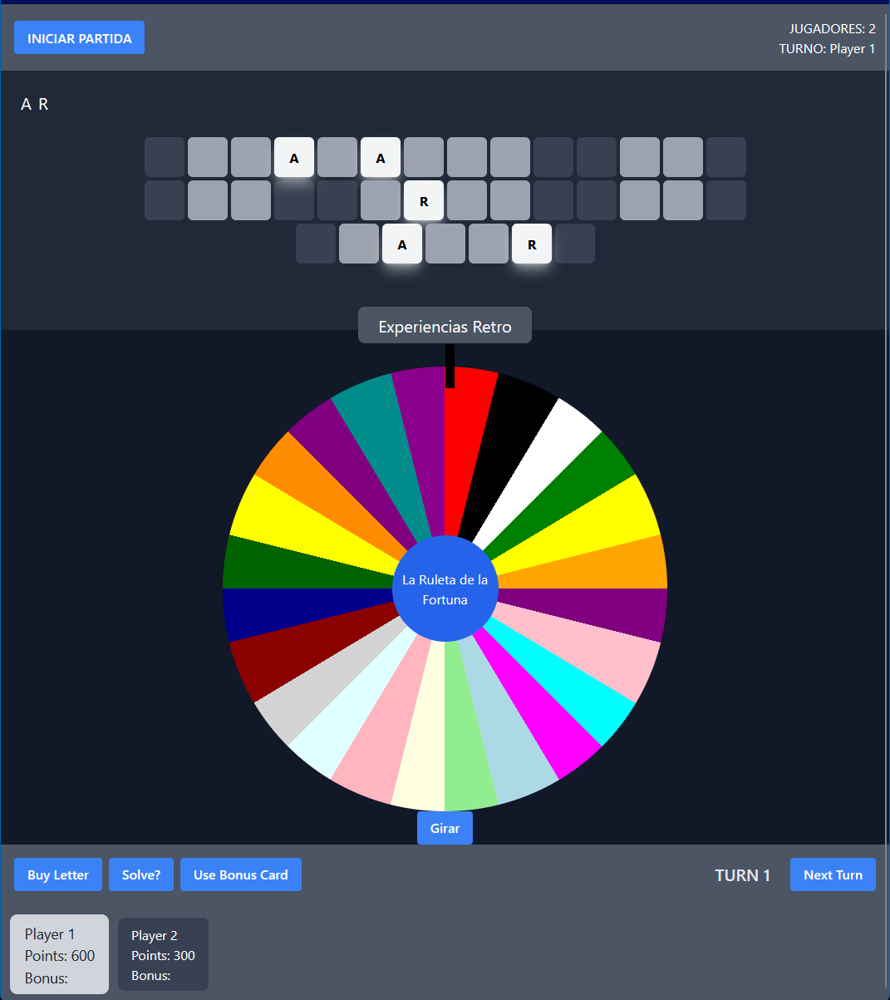

# Wheel of Fortune Game (made with ReactJS-TS-TailwindCSS)



This is a Fortune Wheel game done with Vite, React 18, TypeScript, TailwindCSS 3, Eslint and Prettier.

## What is inside?

This project uses many tools like:

- [Vite](https://vitejs.dev)
- [ReactJS](https://reactjs.org)
- [TypeScript](https://www.typescriptlang.org)
- [Tailwindcss](https://tailwindcss.com)

## Getting Started

### Install

Clone repository and install dependencies.

```bash
git clone https://github.com/N3BB3Z4R/fortune-wheel-game.git

```bash
npm install
```

```bash
npm run dev
```
